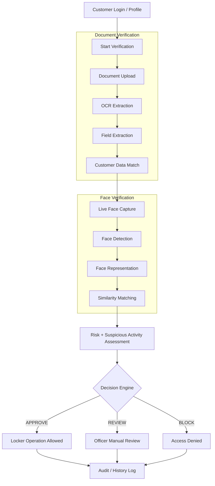
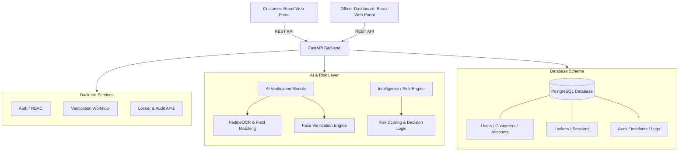

# LockSure
### AI-assisted identity verification and secure bank-locker operations

LockSure is our hackathon prototype for simplifying the process of operating a bank locker.

The idea is simple: instead of making the customer go through several disconnected manual checks, **LockSure** puts the important verification steps into one controlled workflow. The system checks the customer's document, verifies the customer's face, calculates a security/risk decision, and then allows the locker operation only when the required checks are successful.

The project is designed as a **human-in-the-loop** system. AI helps the officer with verification and risk signals, but the system does not hide the evidence or remove the officer from the process.

---

## 1. Problem We Are Solving

The company problem statement is **"Simplification of Locker operating process."**

### In a typical manual process:
1. The customer visits the branch.
2. The officer checks identity documents.
3. The officer manually matches the customer's identity.
4. The locker operation is approved.
5. Records are maintained for the operation.

*This can take time and the verification history can become difficult to track consistently.*

### Our Approach
LockSure creates a digital verification layer around the existing locker process:
* **Secure Login:** Customer logs in securely.
* **Profile Retrieval:** Customer information is retrieved from the system.
* **Document Capture:** The identity document is uploaded/captured.
* **OCR Processing:** OCR extracts important fields from the document.
* **Data Matching:** Extracted information is compared with the customer's stored information.
* **Facial Verification:** The customer captures a live face image and compares it with the trusted reference image.
* **Risk Signal Analysis:** A risk and suspicious-activity check provides an additional security signal.
* **Decision Matrix:** The workflow produces **APPROVE**, **REVIEW**, or **BLOCK**.
* **Audit Logging:** Locker operations and important verification events are recorded in the audit trail.

---

## 2. Main Features

| Module | Features & Capabilities |
| :--- | :--- |
| **Customer Side** | • Secure customer login<br>• Customer profile and account information<br>• Document upload/capture<br>• Document verification status<br>• Live face capture & verification result<br>• Final verification result and locker status |
| **Officer Side** | • Officer login with Role-based access (RBAC)<br>• Customer/verification lookup<br>• Document and face verification results visualization<br>• Risk/security information display<br>• Locker operation controls & Audit history<br>• Security-alert handling |
| **Backend** | • Authentication and authorization (JWT-based)<br>• Role-based access control (RBAC)<br>• Customer, Account, and Locker APIs<br>• Verification workflow and state management<br>• Audit logging engine |
| **AI / Intelligence** | • **PaddleOCR** for document text recognition<br>• Field extraction (Name, DOB, ID Number, Address)<br>• Field normalization and fuzzy matching<br>• Face detection and representation (DeepFace / CV)<br>• Face similarity/match scoring<br>• Rule-based risk scoring & suspicious-activity checks |

---

## 3. End-to-End Workflow


## System Architecture



## Technology Stack

```text
+-------------------------------------------------------------+
|                      TECHNOLOGY STACK                       |
+----------------------+--------------------------------------+
| Layer                | Technology                           |
+----------------------+--------------------------------------+
| Customer / Officer UI| React.js                             |
| Backend API          | Python + FastAPI                     |
| Database             | PostgreSQL                           |
| ORM                  | SQLAlchemy                           |
| Authentication       | JWT + Password Hashing (bcrypt)      |
| Document OCR         | PaddleOCR                            |
| Face Verification    | DeepFace / Computer Vision           |
| Risk Intelligence    | Python Rule-Based Scoring Engine     |
| API Communication    | RESTful APIs                         |
+----------------------+--------------------------------------+
```

## Security Approach

* Authentication First: All sensitive operations require prior authentication.

* Role-Based Authorization: Strict customer vs. officer domain separation.

* Backend Validation: Zero client-side authority over state transitions.

* State Machine Integrity: No locker operation allowed on ambiguous state.

* Human-in-the-Loop: Unclear AI scores route directly to officer review.

* Immutable Audit Trails: Full record of state changes and actions taken.


## Running the Project

* Backend Setup

cd "\backend"

python -m uvicorn main:app --reload

* API Endpoint: http://127.0.0.1:8000
* Swagger Docs: http://127.0.0.1:8000/docs

* Frontend Setup

cd "\frontend"

npm install

npm run dev

## What Makes LockSure Different

1. Unified Verification Engine: Connects document OCR, face match, and risk signals into one workflow.

2. Officer Oversight: Keeps humans in control while eliminating redundant verification overhead.

3. Auditable Operations: Creates a clear history for all locker operations.

## Team

*Team Innovate — I-N-N-O-V-8*

_Progressive Education Society's Modern College of Engineering, Pune._
